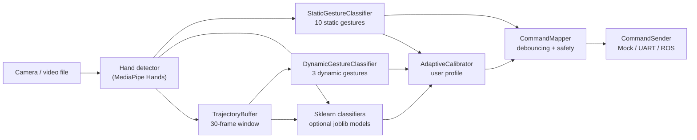

# Архітектура підсистеми жестового керування

## Мета

Архітектура підсистеми розділяє роботу з камерою, розпізнавання жестів, підтвердження
команд і передавання результату роботу. Це потрібно, щоб одну й ту саму логіку можна було
запускати в CLI, у web UI, на записаному відео або під час автоматичного benchmark.

## Компоненти

1. `src.domain` - стабільні ідентифікатори жестів, команд і результатів класифікації.
2. `src.config` - конфігураційні dataclass-об'єкти для порогів, буферів і каналів зв'язку.
3. `src.capture.video_capture` - читання кадрів з камери або відеофайлу, resize, mirror,
   BGR-to-RGB preprocessing.
4. `src.recognition.hand_detector` - wrapper над MediaPipe Hands, який повертає 21 ключову
   точку руки та handedness.
5. `src.utils.geometry` - геометричні операції над 21 ключовою точкою MediaPipe Hands.
6. `src.recognition.static_classifier` - геометричний класифікатор 10 статичних жестів.
7. `src.recognition.trajectory_buffer` - буфер ознак траєкторії для динамічних жестів.
8. `src.recognition.dynamic_classifier` - евристичний класифікатор 3 динамічних жестів.
9. `src.recognition.model_classifier` - завантаження навчених `scikit-learn` моделей.
10. `src.calibration` - адаптивне калібрування користувача, персональні профілі та
   коригування confidence.
11. `src.interpretation.command_mapper` - debouncing і перетворення жестів у команди.
12. `src.transmission` - інтерфейси передачі команд: in-memory, UART, ROS.
13. `src.pipeline` - прикладний pipeline, який поєднує детекцію, класифікацію,
    інтерпретацію та відправлення команд.
14. `src.web_ui` - локальна web-консоль для демонстрації та роботи з browser-camera.

## Потік даних

## Поточний словник жестів

| ID | Жест | Тип | Команда |
|---:|---|---|---|
| 0 | OPEN_PALM | статичний | STOP |
| 1 | FIST | статичний | FORWARD |
| 2 | THUMB_UP | статичний | START |
| 3 | THUMB_DOWN | статичний | EMERGENCY_STOP |
| 4 | INDEX_LEFT | статичний | TURN_LEFT |
| 5 | INDEX_RIGHT | статичний | TURN_RIGHT |
| 6 | PEACE | статичний | INCREASE_SPEED |
| 7 | THREE_FINGERS | статичний | DECREASE_SPEED |
| 8 | PINKY | статичний | RETURN_HOME |
| 9 | OK_SIGN | статичний | CONFIRM_ACTION |
| 10 | WAVE_LR | динамічний | MODE_TOGGLE |
| 11 | CIRCLE | динамічний | ROTATE_360 |
| 12 | PULL_TOWARD | динамічний | APPROACH_OPERATOR |

Словник жестів зафіксований для коду, моделей і benchmark CSV. Якщо мапінг команд буде
змінюватися після тестування з користувачами, числові ID жестів варто залишати стабільними.

## Логіка debouncing

`CommandMapper` не передає команду одразу після першого розпізнавання. Для статичних
жестів потрібна стабільність протягом `static_confirmation_frames`, для динамічних -
підтверджений результат класифікації буфера, для аварійної зупинки використовується
окремий поріг `emergency_confirmation_frames`.

Такий підхід знижує ризик хибних спрацювань, що особливо важливо для критичної команди
`EMERGENCY_STOP`.

## Поточні обмеження

1. Навчені моделі краще працюють на власному контрольному наборі, ніж на IPN Hand subset.
2. ROS-відправник має мінімальний `Twist`-мапінг і потребує перевірки на конкретній платформі.
3. Дані з `data/external/` і `data/processed/` не зберігаються в Git, тому benchmark відтворюється
   після локальної підготовки manifest-файлів.
4. Web UI з browser-camera потребує HTTPS для публічного розгортання, бо браузери блокують
   камеру і mixed-content запити в небезпечному контексті.
