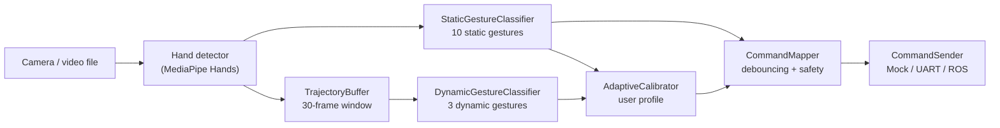

# Архітектура підсистеми жестового керування

## Мета foundation-рівня

Foundation-рівень створено як першу робочу основу дипломного проєкту. Його задача -
відокремити доменні поняття, розпізнавання жестів, інтерпретацію команд і транспортний
шар так, щоб надалі можна було додати LSTM-класифікатор, адаптивне калібрування та
UX-фідбек без переписування базової архітектури.

## Компоненти

1. `src.domain` - стабільні ідентифікатори жестів, команд і результатів класифікації.
2. `src.config` - конфігураційні dataclass-об'єкти для порогів, буферів і каналів зв'язку.
3. `src.capture.video_capture` - читання кадрів з камери або відеофайлу, resize, mirror,
   BGR-to-RGB preprocessing.
4. `src.recognition.hand_detector` - wrapper над MediaPipe Hands, який повертає 21 ключову
   точку руки та handedness.
5. `src.utils.geometry` - геометричні операції над 21 ключовою точкою MediaPipe Hands.
6. `src.recognition.static_classifier` - rule-based класифікатор 10 статичних жестів.
7. `src.recognition.trajectory_buffer` - буфер ознак траєкторії для динамічних жестів.
8. `src.recognition.dynamic_classifier` - baseline-класифікатор 3 динамічних жестів.
9. `src.calibration` - адаптивне калібрування користувача, персональні профілі та
   коригування confidence.
10. `src.interpretation.command_mapper` - debouncing і перетворення жестів у команди.
11. `src.transmission` - інтерфейси передачі команд: mock, UART, ROS.
12. `src.pipeline` - прикладний pipeline, який поєднує детекцію, класифікацію,
    інтерпретацію та відправлення команд.

## Потік даних

## Поточний словник жестів

| ID | Жест | Тип | Команда |
|---:|---|---|---|
| 0 | OPEN_PALM | статичний | STOP |
| 1 | FIST | статичний | FORWARD |
| 2 | THUMB_UP | статичний | START |
| 3 | THUMB_DOWN | статичний | EMERGENCY_STOP |
| 4 | INDEX_LEFT | статичний | TURN_LEFT |
| 5 | INDEX_RIGHT | статичний | TURN_RIGHT |
| 6 | PEACE | статичний | INCREASE_SPEED |
| 7 | THREE_FINGERS | статичний | DECREASE_SPEED |
| 8 | PINKY | статичний | RETURN_HOME |
| 9 | OK_SIGN | статичний | CONFIRM_ACTION |
| 10 | WAVE_LR | динамічний | MODE_TOGGLE |
| 11 | CIRCLE | динамічний | ROTATE_360 |
| 12 | PULL_TOWARD | динамічний | APPROACH_OPERATOR |

Команди для динамічних жестів є стартовою інженерною гіпотезою. Після UX-дослідження
словник може бути уточнений, але числові ID залишаються стабільними для датасету.

## Логіка debouncing

`CommandMapper` не передає команду одразу після першого розпізнавання. Для статичних
жестів потрібна стабільність протягом `static_confirmation_frames`, для динамічних -
підтверджений результат класифікації буфера, для аварійної зупинки використовується
окремий поріг `emergency_confirmation_frames`.

Такий підхід знижує ризик хибних спрацювань, що особливо важливо для критичної команди
`EMERGENCY_STOP`.

## Розширення до дипломної версії

Наступні модулі додаються поверх поточного foundation-рівня:

1. LSTM/1D-CNN класифікатор динамічних жестів, який використовує дані `TrajectoryBuffer`.
2. `feedback` - UX-шар візуального підтвердження команди.
3. `experiments` - відтворювані експерименти з CSV, графіками та довірчими інтервалами.
4. `docs/ux_research` - протоколи інтерв'ю, картковий метод, SUS/NASA-TLX.
